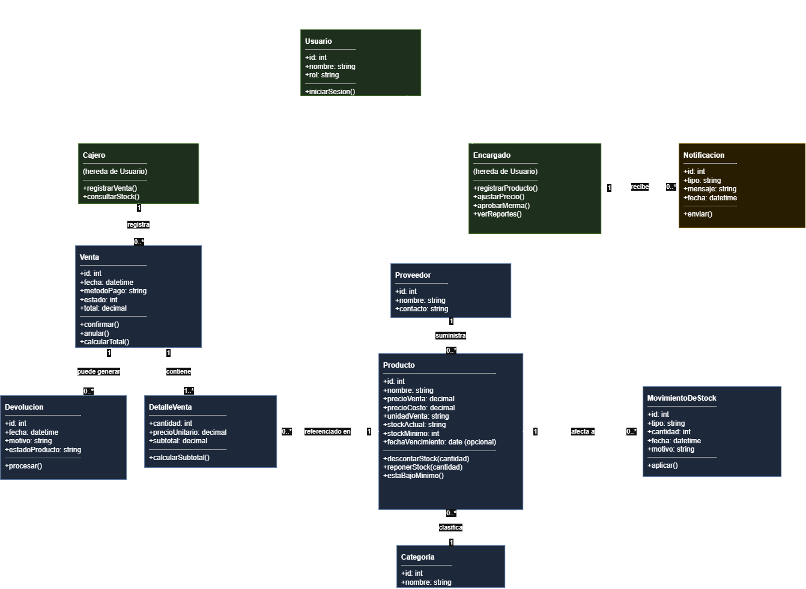

# H1 — Inventario del caso
 
**Sistema:** Minimarket "El Ahorro" · Variante 4 · Comercio
 
 
## 1. Actores
 
**Cajero** (actor primario) — atiende en caja. Quiere registrar una venta rápido, sin trabarse, y poder consultar precio o stock de un producto sin tener que llamar al encargado.
 
**Encargado / Dueño** (actor primario) — administra el negocio. Quiere ver en todo momento si el stock real coincide con el del sistema, enterarse a tiempo cuando un producto está por agotarse, y tener un resumen claro de qué se vendió para decidir qué reponer.
 
**Cliente** (actor secundario) — no opera el sistema directamente, pero es quien dispara la venta y quien recibe la notificación cuando compra fiado. Quiere que el producto que busca esté disponible y que le cobren rápido y bien.
 
**Proveedor** (actor secundario / externo) — entrega mercadería al minimarket. No usa el sistema, pero sus entregas quedan registradas como ingresos de stock que el encargado carga.
 
 
## 2. Inventario de módulos
 
| Módulo | Responsabilidad única |
|---|---|
| Catálogo | Mantener productos, categorías y precios actualizados. |
| Ventas | Gestionar el ciclo de una venta en caja, del carrito al cierre. |
| Inventario | Registrar y consolidar todo movimiento que afecte el stock (venta, ingreso, devolución, merma, ajuste). |
| Notificaciones | Avisar al encargado cuando un producto cruza su stock mínimo. |
| Reportes | Generar resúmenes de ventas e inventario para tomar decisiones. |
| Usuarios y Roles | Controlar quién entra al sistema y qué puede hacer según su rol. |
 
 
## 3. Primer diagrama de clases
 
Aplicando la receta de 4 pasos sobre el requerimiento del minimarket:
 
1. **Sustantivos** (candidatos a clase o atributo): producto, categoría, venta, detalle de venta, movimiento de stock, devolución, usuario, cajero, encargado, proveedor, notificación.
2. **Verbos** (candidatos a método): registrar, buscar, confirmar, anular, descontar, reponer, avisar, aprobar, reportar.
3. **Filtro** — de esos sustantivos, ¿cuáles tienen datos propios y comportamiento propio? *Detalle de venta* pasó el filtro (cantidad y precio unitario de esa línea específica, no de Venta ni de Producto) → es clase, no atributo. *Precio* y *stock mínimo*, en cambio, no tienen comportamiento propio → quedan como atributos de Producto.
4. **Relaciones**, con multiplicidad solo donde aporta:

 

 
## 4. Atributos de calidad críticos
 
**Idoneidad funcional.** El stock que muestra el sistema tiene que ser exactamente el real. En este dominio el número de stock lo alimentan cinco fuentes distintas (venta, ingreso, devolución, merma, ajuste); si una sola de esas rutas descuadra el número, el encargado termina prometiendo un producto que no existe o dejando de reponer uno que sí hace falta. Es el atributo que más plata cuesta si falla.
 
**Usabilidad.** En caja, con el cliente esperando, el cajero necesita registrar una venta en pocos segundos y sin pasos de más. Una interfaz lenta o confusa en el punto de venta no es un detalle estético: se traduce directo en cola, en errores de tipeo bajo presión, y en clientes que se van a la competencia.
