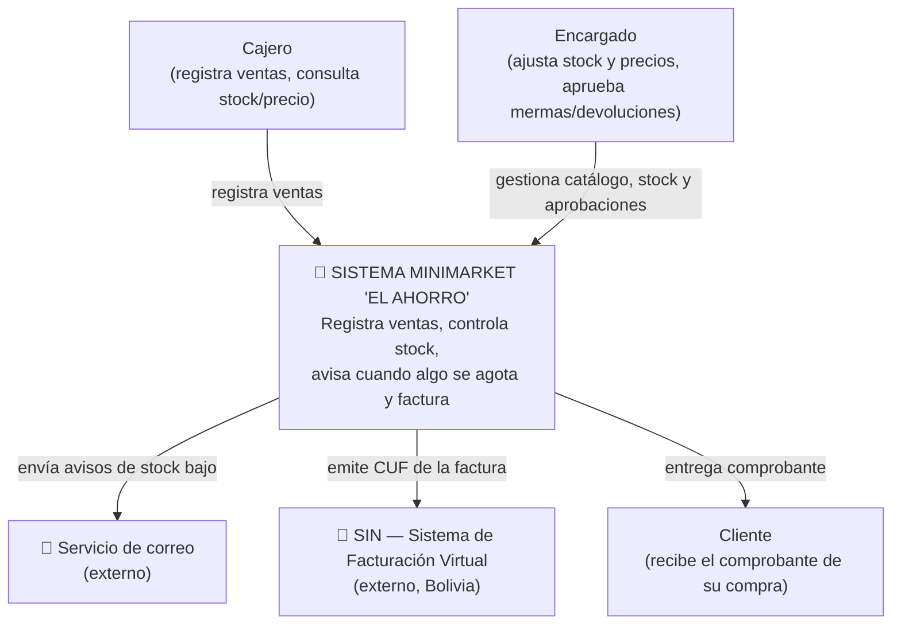
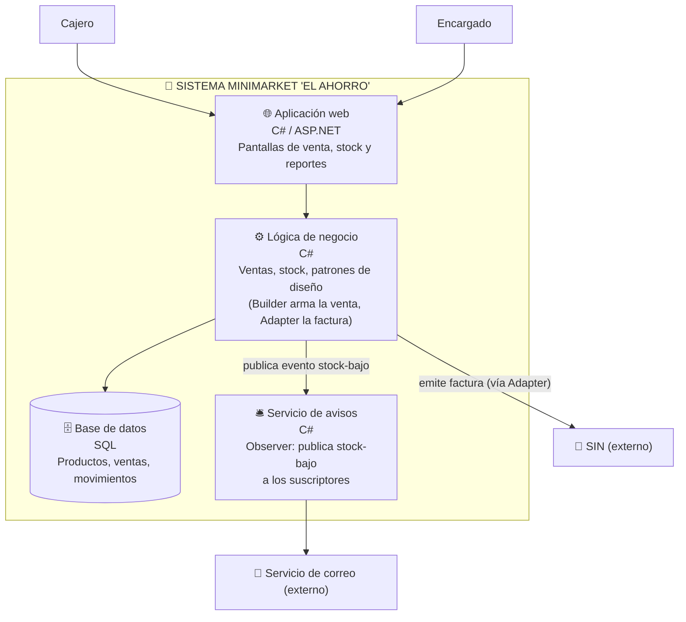

# H4 — Documentación con C4: Minimarket "El Ahorro"

Este documento describe la arquitectura del sistema en dos niveles del modelo C4, y explica donde vive la fusion de patrones (h3/final/) dentro de esa arquitectura. El diagrama vive en este repositorio: si el sistema cambia, el diagrama se actualiza en el mismo commit.

## Nivel 1 — Contexto

Responde una sola pregunta: ¿quién usa el sistema y con qué otros sistemas habla? Los actores son los mismos del H1 (Cajero y Encargado, con sus roles del RF4), y los dos sistemas externos son reales para un minimarket en Bolivia: el servicio de correo (para los avisos del RF5) y el SIN, la entidad que exige la facturacion electronica.

Ningún detalle interno aparece en este nivel — ni la base de datos, ni las clases, ni los patrones. Eso se ve recién en el Nivel 2.

## Nivel 2 — Contenedores

Responde: ¿de que piezas ejecutables o de almacenamiento esta hecho el sistema? Cada caja dentro del recuadro es algo que corre o se consulta por separado; las cajas externas (SIN, correo) quedan afuera, porque no son piezas que yo controle.

Acá es donde se ve dónde vive cada patrón de diseño:
- **Lógica de negocio** es el contenedor donde corren los 7 patrones del laboratorio (h3/). En particular, la fusión de h3/final/ — ArmadorDeVenta (Builder) y AdaptadorFacturacionSIN (Adapter) vive aqui, y es la responsable de la flecha "emite factura (vía Adapter)" hacia el SIN.
- **Servicio de avisos** es el Observer de h3/con-observer/: ControlDeStock publica el evento de stock bajo y este contenedor lo recibe y lo reenvía por correo.

