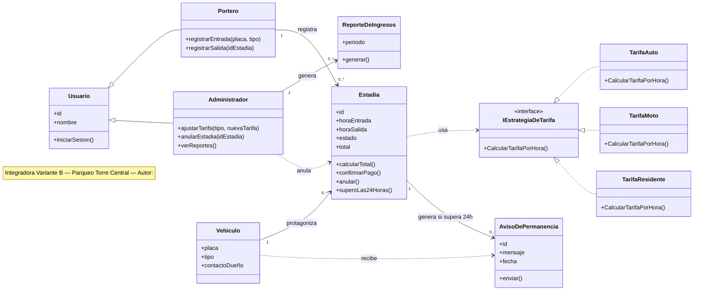

# Parte 1:  El plano

## La receta de 4 pasos

**Sustantivos** candidatos a clase o atributo: vehiculo, placa, tipo de vehiculo, estadia, tarifa, portero, administrador, aviso, reporte, dueño.

**Verbos** candidatos a meetodo: registrar entrada, registrar salida, calcular total, confirmar pago, anular, ajustar tarifa, avisar, generar reporte.

**Filtro clase vs. atributo:** Vehiculo pasa el filtro (tiene datos propios —placa, tipo, contacto del dueño y existe independientemente de una estadia puntual: el mismo auto entra y sale muchas veces) es clase. estado de la estada no tiene comportamiento propio por lo tanto queda como atributo de Estadia.

**Relaciones**, con multiplicidad donde aporta informacion real: un vehiculo protagoniza muchas estadias a lo largo del tiempo (1 a 0..*); un portero registra muchas estadias (1 a 0..*); una estadia puede generar como mucho un aviso, si supera las 24 horas (0..1).

## El diagrama de clases

- Usuario es el padre de Portero y Administrador — cada uno hereda solo id, nombre e iniciarSesion(), y agrega los métodos de su propio rol. Ninguno hereda un método que no pueda cumplir
- Estadia.estado recorre los 4 valores del enunciado: en curso, por pagar, pagada / anulada.
- AvisoDePermanencia cubre el requerimiento de las 24 horas; el destinatario es el Vehiculo (su dueño), no un rol del sistema por eso la flecha sale de Vehiculo, no de Portero o Administrador.

