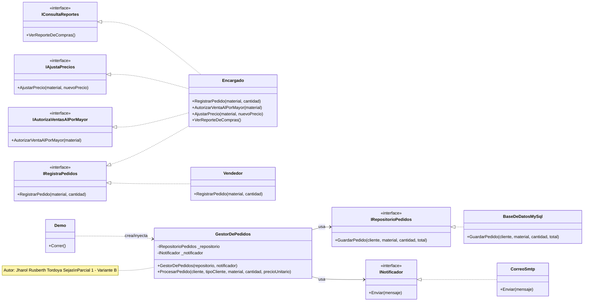

# P1.3 — Diagrama de clases (después de las curas ISP y DIP)
 
**Nombre completo: Jharol Rusberth Tordoya Sejas**
 

```mermaid
classDiagram
    direction LR
 
    class IRegistraPedidos {
        <<interface>>
        +RegistrarPedido(material, cantidad)
    }
    class IAutorizaVentasAlPorMayor {
        <<interface>>
        +AutorizarVentaAlPorMayor(material)
    }
    class IAjustaPrecios {
        <<interface>>
        +AjustarPrecio(material, nuevoPrecio)
    }
    class IConsultaReportes {
        <<interface>>
        +VerReporteDeCompras()
    }
 
    class Encargado {
        +RegistrarPedido(material, cantidad)
        +AutorizarVentaAlPorMayor(material)
        +AjustarPrecio(material, nuevoPrecio)
        +VerReporteDeCompras()
    }
    class Vendedor {
        +RegistrarPedido(material, cantidad)
    }
 
    IRegistraPedidos <|.. Encargado
    IAutorizaVentasAlPorMayor <|.. Encargado
    IAjustaPrecios <|.. Encargado
    IConsultaReportes <|.. Encargado
    IRegistraPedidos <|.. Vendedor
 
    class IRepositorioPedidos {
        <<interface>>
        +GuardarPedido(cliente, material, cantidad, total)
    }
    class INotificador {
        <<interface>>
        +Enviar(mensaje)
    }
    class BaseDeDatosMySql {
        +GuardarPedido(cliente, material, cantidad, total)
    }
    class CorreoSmtp {
        +Enviar(mensaje)
    }
    class GestorDePedidos {
        -IRepositorioPedidos _repositorio
        -INotificador _notificador
        +GestorDePedidos(repositorio, notificador)
        +ProcesarPedido(cliente, tipoCliente, material, cantidad, precioUnitario)
    }
    class Demo {
        +Correr()
    }
 
    IRepositorioPedidos <|.. BaseDeDatosMySql
    INotificador <|.. CorreoSmtp
    GestorDePedidos --> IRepositorioPedidos : usa
    GestorDePedidos --> INotificador : usa
    Demo ..> GestorDePedidos : crea/inyecta
 
    note for GestorDePedidos "Autor: Jharol Rusberth Tordoya Sejas\nParcial 1 - Variante B"
```
